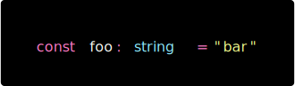

- Language: TypeScript
- Font: hack
- Theme: dracula

<table>
  <th>
  Github
  </th>
  <th>
  Shiki
  </th>
  <tr>
  <td>

```ts
const foo: string = "bar";
```

</td>
  <td>



</td>
  </tr>
</table>
